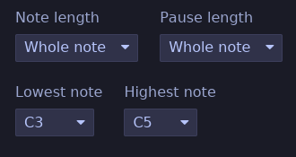
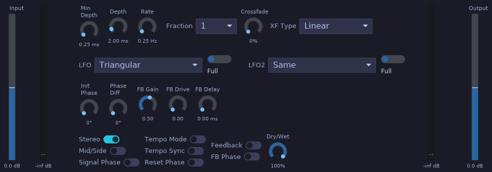
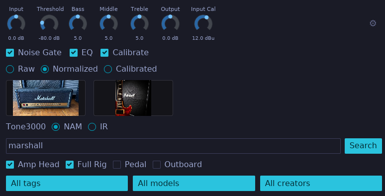
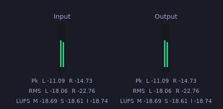

# Maolan Plugins

The complete Maolan in-house plugin collection. Built in Rust as CLAP plugins with Iced-based GUIs in the TokyoNight theme.

- 23 exported variants
- 22 distinct products
- Iced TokyoNight GUI
- BSD-2 license

## Instruments

### Drums

Plugin ID: `rs.maolan.drums`

Drum sampler CLAP plugin inspired by DrumGizmo. Async kit loading, MIDI triggering, velocity mapping, round-robin, humanization, per-output balancing, and built-in limiter. 16 mono outputs (Kick L/R, Snare L/R, HiHat L/R, Toms L/R, Ride L/R, Crash L/R, China/Splash L/R, Ambience L/R).

### Kick

Plugin ID: `rs.maolan.kick`

Percussive synthesizer with layered oscillators and noise. MIDI note-triggered with 16 mono outputs, velocity sensitivity, and a multi-layer DSP engine. Suitable for designing kick and percussion sounds from scratch without sample content.

### Random

Plugin ID: `rs.maolan.random`

A singing practice MIDI source that emits a random reference pitch, pauses for you to sing it back, and repeats while the session transport plays. It generates MIDI notes within the selected range (C3 to C5 by default), with no consecutive repeated pitches unless the range contains only one note. No MIDI input or audio output is needed.

The **Note length** and **Pause length** dropdowns control their durations independently: 1/16, 1/8, 1/4, 1/2, or whole notes, and 1, 2, or 4 bars. Both default to one bar. Note values follow the session tempo; bars also follow its time signature (one bar is three quarter notes in 3/4 or six eighth notes in 6/8). Stopping sends a MIDI note-off if a generated note is active; starting begins a new note and pause cycle. Generated MIDI notes use channel 1 and velocity 100. Route the MIDI output to an instrument to hear the reference pitch.

**Lowest note** and **Highest note** set the inclusive pitch range, using note names from C-1 to G9 (middle C is C4). The dropdowns keep the lowest note at or below the highest note. Choose the same note in both to practice one pitch repeatedly. Range changes apply to the next note, and all four settings are saved with the session.

### Sampler

Plugin ID: `rs.maolan.sampler`

Polyphonic sample player supporting **SFZ (v1/v2)** and **SoundFont 2 (SF2.01/SF2.04)** instruments in addition to standalone WAV files.

- **SFZ Format Engine:** Includes preprocessor for `#include` relative path imports, `#define` macros, `#if`/`#else`/`#endif` blocks, and header scope precedence (`control` → `global` → `master` → `group` → `region`). Supports core v1/v2 opcodes for key/velocity mapping, key crossfades, tuning, panning, loops, playback directions, keyswitches, round-robin / random variants, envelope generators, LFOs, and multimode filters.
- **SoundFont 2 (SF2) Engine:** Parses RIFF SoundFont files with 16-bit and 24-bit PCM sample data, `INFO` metadata, multi-preset bank structures, generator hierarchy merging (`GeneratorSet`), and default/custom `imod` modulators mapped to the modulation matrix.
- **Background Loading:** Instrument parsing and resample rendering occur asynchronously on a background worker thread. New patches swap into the audio engine atomically (`AtomicArc`) without interrupting active voices or causing audio dropouts.
- **Interactive GUI:** Supports drag-and-drop file loading, bank/preset dropdown selection, real-time loading progress indicator, instant reload button for SFZ editing, and scrollable diagnostic error logging.

### Synth

Plugin ID: `rs.maolan.synth`

Polyphonic synthesizer inspired by Surge XT. Features three oscillators with multiple synthesis
modes (including wavetable, FM, and physical-modeling flavors), two multimode filters with
configurable routing, three envelopes, six LFOs, a 12-slot modulation matrix, an MSEG, a step
sequencer, noise and waveshaper sections, and microtonal tuning support. Stereo I/O.

**Parameter groups**

| Group | Description |
|-------|-------------|
| Osc1–Osc3 | Type, octave, semitone, fine, shape, skew, formant, level, unison, sync, sub, routing, solo/mute |
| Filter1–Filter2 | Type, subtype, cutoff, resonance, EG amount, key tracking, drive, feedback, enable |
| Filter | Filter routing and balance |
| AmpEG / FilterEG / PitchEG | Attack, decay, sustain, release, mode, shapes, retrigger, tempo sync, uber release |
| LFO1–LFO6 | Rate, shape, amount, deform, trigger, sync mode/division, envelope, phase, unipolar |
| Mod | Fixed mod depths (velocity/key/LFO to filter, mod wheel/aftertouch to filter) |
| ModRoute1–12 | Source, target, depth, curve |
| Noise | Type, level, color, filter, stereo, enabled |
| Waveshaper | Shape, drive, mix, enable |
| Flavor | Additional filter-like flavor stage |
| Step Seq | 16 step values, loop start/end, shuffle, trigger targets |
| MSEG | 128 nodes, 127 segment curves, loop, retrigger targets |
| Macros | Macro1–8 modulation sources |
| Master | Volume, pan, width, polyphony, portamento, pitch-bend range, play mode, voice priority |
| Tuning | Scale, root, SCL index |
| FM / Twist / String / Alias | Oscillator-specific parameters for FM, twist, string, and alias engines |

## Effects

### Chorus

Plugin ID: `rs.maolan.chorus`

Multi-voice stereo chorus with modulated delay lines. Even voices read from the left channel and odd voices from the right, producing a wide stereo image.

**Parameters**

| Parameter | Range | Default | Description |
|-----------|-------|---------|-------------|
| Mod Depth | 0.0 ... 10.0 ms | 5.0 | LFO delay modulation depth |
| Mod Rate | 0.1 ... 5.0 Hz | 0.5 | LFO rate |
| Dry/Wet | 0.0 ... 1.0 | 0.5 | Mix balance |
| Voices | 2 ... 16 | 8 | Number of chorus voices |

### Compressor

Plugin ID: `rs.maolan.compressor`

Multiband compressor with LR4 crossovers. Peak/RMS sidechain, FabFilter Pro-MB-style Compress/Expand modes with signed Range, lookahead, sidechain boost, and classic/modern topology. Double-click the spectrum display to add bands. Drag crossover lines to move splits. Drag the white gain contour to adjust Gain/Makeup for the band under the cursor; middle-drag it to adjust Range; right-drag it to adjust Threshold. Drag the yellow contour to adjust Range directly, or the blue contour to adjust Threshold directly. Negative Range draws below gain and positive Range draws above it.

### DeEsser

Plugin ID: `rs.maolan.deesser`

Sibilance reduction processor. Detects ess sounds via slew-rate patterns across a configurable window. IIR smoothing, dynamic ratio reduction, and monitor mode. Stereo I/O.

### Delay

Plugin ID: `rs.maolan.delay`

Delay with millisecond or tempo-synced note divisions. Circular buffers with linear interpolation and smooth delay-time chasing. Reads host BPM from CLAP transport.

### Formant

Plugin ID: `rs.maolan.formant`

Vowel formant filter using three constant-Q bandpass biquads per channel. The Vowel control crossfades between the A, E, I, O, and U vowel tables for continuous timbre shaping.

**Parameters**

| Parameter | Range | Default | Description |
|-----------|-------|---------|-------------|
| Vowel (A-E-I-O-U) | 0.0 ... 4.0 | 0.0 | Vowel selector with interpolation |
| Sharpness (Q) | 2.0 ... 40.0 | 2.0 | Bandpass filter Q |
| Output Gain | −60.0 ... 20.0 dB | 0.0 | Output gain |

### Flanger

Plugin ID: `rs.maolan.flanger`

Stereo flanger with LFO-modulated delay lines and a separate feedback path, ported from LSP Plugins' Flanger Stereo algorithm. Offers 13 LFO shapes (plus off) with independent right-channel LFO, tempo-synced rate, wrap crossfading, mid/side processing, and feedback with drive and delay. The Stereo switch selects stereo (2 audio ports, default) or mono (1 audio port) I/O and asks the host to rescan audio ports when changed; the stereo-only parameters (LFO 2, Phase difference L/R, Mid/Side) apply when Stereo is on.

**Parameters**

| Parameter | Range | Default | Description |
|-----------|-------|---------|-------------|
| Stereo | Off / On | On | Switch between stereo (2 audio ports) and mono (1 audio port) I/O |
| Rate | 0.01 ... 20.0 Hz | 0.25 | LFO rate |
| Tempo | 20 ... 360 BPM | 120 | Tempo for tempo time mode |
| Tempo Sync | Off / On | Off | Read BPM from host transport |
| Time Mode | Rate / Tempo | Rate | How the LFO rate is determined |
| Time Fraction | 1/64 ... 8 | 1 | Note fraction for tempo mode |
| Crossfade | 0 ... 50 % | 0 | Wrap crossfade length (fraction of half cycle) |
| Crossfade Type | Const power / Linear | Const power | Audible crossfade law (feedback always linear) |
| LFO Type | 13 shapes + Off | Triangular | Left channel LFO shape |
| LFO Period | Full / First / Last | Full | Portion of the LFO cycle used |
| LFO2 Type | Same + 13 shapes + Off | Same | Right channel LFO shape |
| LFO2 Period | Full / First / Last | Full | Right channel LFO period |
| Initial Phase | 0 ... 360° | 0 | LFO phase after reset |
| Phase Diff L/R | 0 ... 360° | 0 | Phase shift between channels |
| Reset Phase | trigger | — | Restart the LFO at the initial phase |
| Mid/Side | Off / On | Off | Process mid and side independently |
| Min Depth | 0.01 ... 10.0 ms | 0.25 | Minimum delay |
| Depth | 0.1 ... 20.0 ms | 2.0 | LFO delay sweep depth |
| Signal Phase | Off / On | Off | Invert the wet signal polarity |
| Feedback On | Off / On | Off | Enable the feedback path |
| Feedback Gain | 0.0 ... 0.89125 | 0.5 | Feedback amount (−6 dB default) |
| Feedback Drive | 0.0 ... 1.0 | 0.0 | Input drive into the feedback path |
| Feedback Delay | 0.0 ... 5.0 ms | 0.0 | Extra feedback path delay |
| Feedback Phase | Off / On | Off | Invert feedback gain and drive |
| Input Gain | −24.0 ... 24.0 dB | 0.0 | Input gain |
| Dry/Wet | 0.0 ... 1.0 | 0.5 | Dry/wet mix balance |
| Output Gain | −24.0 ... 24.0 dB | 0.0 | Output gain |

### Limiter

Plugin ID: `rs.maolan.limiter`

Adaptive clipper/limiter with Vintage and Modern variants. Multiple limiting modes from subtle attenuation to aggressive clipping. Stereo I/O.

### Modeler

Plugin ID: `rs.maolan.modeler`

Neural Amp Modeler (NAM) plugin. Loads neural network amp models and impulse responses. Includes a noise gate, tone stack (Bass/Mid/Treble), input/output calibration, and DC blocking. Mono I/O.

### Parametric EQ

Plugin ID: `rs.maolan.equalizer`

32-band parametric equalizer using peaking biquad filters. Each band has independent Frequency, Gain, Q, Type, Slope, and Dynamics controls. Middle-drag a selected bell band dot to create or adjust its dynamic range target. Input and output gain with global bypass. Mono or stereo I/O depending on host channel count.

### Phaser

Plugin ID: `rs.maolan.phaser`

Modulated all-pass cascade phaser. The LFO sweeps the center frequency of up to 12 first-order all-pass stages. Feedback can be taken from the previous output or from a configurable delay line.

**Parameters**

| Parameter | Range | Default | Description |
|-----------|-------|---------|-------------|
| LFO Rate | 0.01 ... 2.0 Hz | 0.1 | LFO rate |
| LFO Depth | 0.0 ... 1.0 | 0.5 | LFO modulation depth |
| Manual (Center) | 0.0 ... 1.0 | 0.5 | Manual center position |
| Feedback | −0.98 ... 0.98 | 0.0 | Feedback amount |
| Feedback Delay On | 0 / 1 | 0 | Use delay-line feedback instead of previous output |
| Delay Time | 0.0 ... 20.0 ms | 1.0 | Feedback delay time |
| Stages (All-pass) | 1 ... 12 | 12 | Number of all-pass stages |

### Reverb

Plugin ID: `rs.maolan.reverb`

Stereo reverb built from three allpass-like delay blocks with cross-feedback, vibrato predelay, and input/output lowpass filters. Based on Airwindows Reverb.

### Saturator

Plugin ID: `rs.maolan.saturator`

Waveshape saturation with sine-based distortion and intensity-dependent blend. Stereo I/O.

### Stereo

Plugin ID: `rs.maolan.stereo`

Multiband stereo width processor with four sections: Gain, Delay, Character, and Output. Uses
LR4 crossovers and mid/side processing per band. Monitor mode for checking stereo, mono, and
side signals. Stereo I/O. Best suited for single instruments.

- **Gain** — per-band width gains (Low/Mid/High), crossover frequencies (X1, X2), and the global
  side Boost.
- **Delay** — per-band Haas-style delays (Low/Mid/High Delay) with a shared Strength control.
- **Character** — sin/cos mid/side density with offset delay, inherited from the former Stereo
  plugin design. Density shapes the side, Focus the mid, and Amount sets the effect mix.
- **Output** — output Volume, Monitor Mode (Stereo/Mono/Side), and per-band solos.

Each of the Gain, Delay, and Character sections can be switched on or off from the GUI with the
section switches (Gain, Delay, Character Off/On toggles at the head of each section). The
switches are GUI-only controls; they are not automatable parameters. When both Gain and Delay
are switched off, the crossover band split is bypassed entirely and the signal goes straight to
the Character section (or to the output when Character is off as well).

### Tuner

Plugin ID: `rs.maolan.tuner`

Monophonic pitch tuner using the YIN algorithm. Adjustable reference pitch and clarity threshold for reliable pitch detection.

**Parameters**

| Parameter | Range | Default | Description |
|-----------|-------|---------|-------------|
| Reference Hz | 420.0 ... 460.0 | 440.0 | Tuning reference frequency |
| Clarity Threshold | 0.0 ... 1.0 | 0.7 | Minimum clarity for pitch detection |

### VU

Plugin ID: `rs.maolan.vumeter`

Stereo VU meter for diagnostics. Two audio inputs (Left/Right) with ballistics-style VU displays and no parameters. Use it to monitor signal levels on any channel.

### Vocoder

Plugin ID: `rs.maolan.vocoder`

24-band filter-bank vocoder. Each band has its own envelope follower that shapes the band-limited signal before summing. Spectral Shift transposes the entire filter bank.

**Parameters**

| Parameter | Range | Default | Description |
|-----------|-------|---------|-------------|
| Spectral Shift | 0.5 ... 4.0 | 0.5 | Filter-bank frequency shift multiplier |
| Dry/Wet | 0.0 ... 1.0 | 1.0 | Mix balance |

### Wah

Plugin ID: `rs.maolan.wah`

Resonant wah-wah filter with pedal, LFO, and envelope follower modes. The filter sweeps a resonant lowpass/bandpass-style response between Min and Max Cutoff, driven manually by the Position control, automatically by an LFO, or by the input signal envelope.

**Parameters**

| Parameter | Range | Default | Description |
|-----------|-------|---------|-------------|
| Mode | 0.0 ... 2.0 | 0.0 | Sweep mode (Pedal / LFO / Envelope) |
| Min Cutoff | 50.0 ... 2000.0 | 300.0 | Minimum filter cutoff |
| Max Cutoff | 500.0 ... 10000.0 | 3000.0 | Maximum filter cutoff |
| Resonance | 0.1 ... 10.0 | 4.0 | Filter resonance |
| Position | 0.0 ... 1.0 | 0.5 | Manual pedal position |
| LFO Rate | 0.1 ... 20.0 | 2.0 | LFO rate |
| LFO Depth | 0.0 ... 1.0 | 0.5 | LFO modulation depth |
| LFO Shape | 0.0 ... 3.0 | 0.0 | LFO waveform |
| Env Attack | 1.0 ... 500.0 | 20.0 | Envelope follower attack time |

## Plugin Format

All Maolan plugins are distributed as CLAP (CLever Audio Plugin) binaries with embedded Iced GUIs. They support Linux, FreeBSD, macOS, and Windows.

The plugin collection is developed in the [plugins](https://github.com/maolan/plugins) repository. UI windowing is handled by [baseview](https://github.com/maolan/baseview), a low-level window system interface for audio plugin UIs. Extra widgets are implemented as part of
[maolan-widgets](https://github.com/maolan/widgets) repository.
